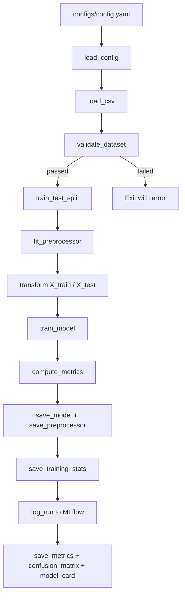
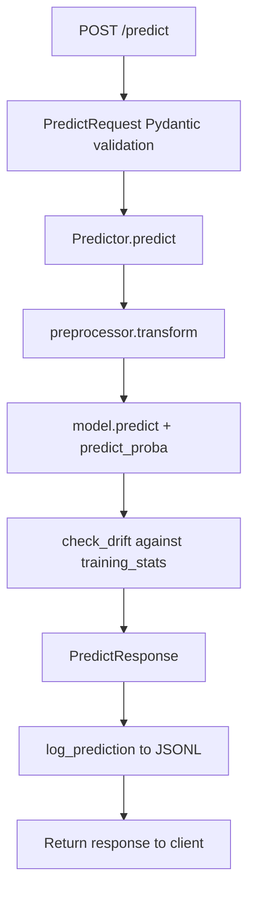
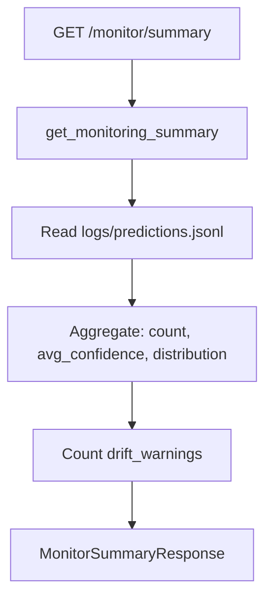
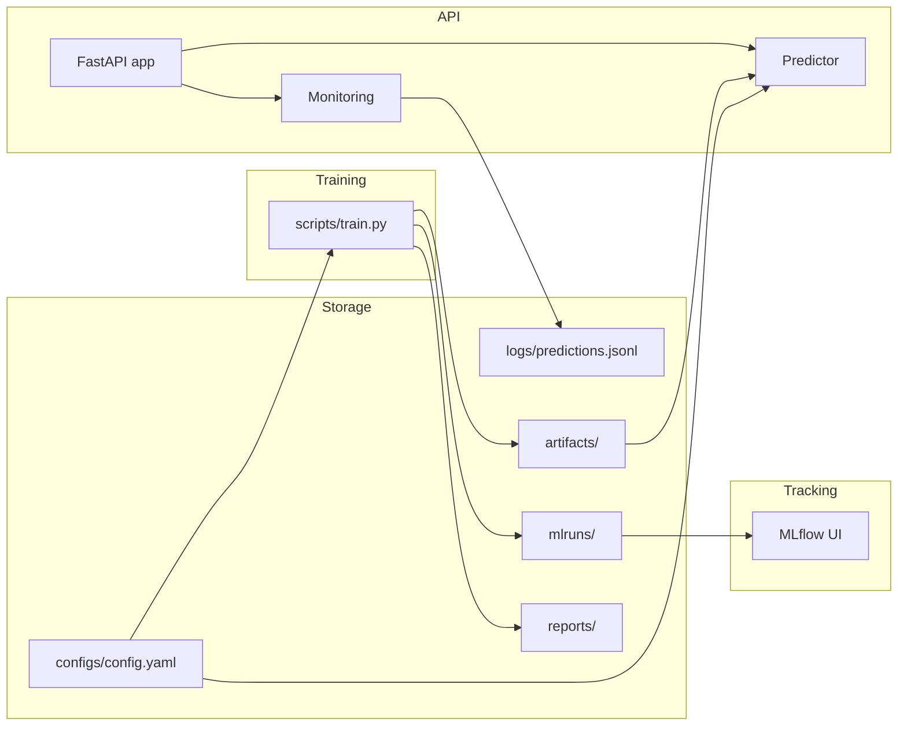

# Architecture — MLOps Production Classification Service

## System Architecture

The service is composed of four independent pipelines that share only artifacts (files on disk) and configuration:

```
┌─────────────────────────────────────────────────────────────────┐
│                        Training Pipeline                        │
│  CSV → Loader → Validator → Preprocessor → Model → Evaluator  │
│                     ↓ artifacts/ ↓                              │
└─────────────────────────────────────────────────────────────────┘
         ↓ model.joblib + preprocessor.joblib + training_stats.json
┌─────────────────────────────────────────────────────────────────┐
│                      Inference Pipeline                         │
│  Request → Pydantic → Predictor → Response + Drift Check       │
│                     ↓ logs/ ↓                                   │
└─────────────────────────────────────────────────────────────────┘
         ↓ predictions.jsonl
┌─────────────────────────────────────────────────────────────────┐
│                     Monitoring Pipeline                         │
│  Read JSONL → Aggregate → Summary Response                     │
└─────────────────────────────────────────────────────────────────┘
┌─────────────────────────────────────────────────────────────────┐
│                    MLflow Tracking                              │
│  Params + Metrics + Artifacts → mlruns/                        │
└─────────────────────────────────────────────────────────────────┘
```

## Training Pipeline



## Inference Pipeline



## Monitoring Pipeline



## Overall Architecture



## Artifact Management

| Artifact | Path | Created by | Consumed by |
|---|---|---|---|
| Trained model | `artifacts/model/model.joblib` | `scripts/train.py` | `app/predictor.py`, `scripts/evaluate.py` |
| Preprocessor | `artifacts/preprocessing/preprocessor.joblib` | `scripts/train.py` | `app/predictor.py`, `scripts/evaluate.py` |
| Training stats | `artifacts/preprocessing/training_stats.json` | `scripts/train.py` | `app/predictor.py` (drift) |
| Validation report | `reports/data_validation.json` | `scripts/train.py` | MLflow, human review |
| Metrics | `reports/metrics.json` | `scripts/train.py` / `evaluate.py` | MLflow, model card |
| Confusion matrix | `reports/figures/confusion_matrix.png` | `scripts/evaluate.py` | Human review |
| Model card | `reports/model_card.md` | `scripts/evaluate.py` | Human review |
| Prediction log | `logs/predictions.jsonl` | `app/monitoring.py` | `GET /monitor/summary` |

## MLflow Tracking Flow

1. `scripts/train.py` calls `setup_mlflow()` to set experiment.
2. `log_run()` opens an `mlflow.start_run()` context.
3. Parameters (model type, seed, feature counts) are logged with `log_params`.
4. Scalar metrics (accuracy, f1, roc_auc) are logged with `log_metrics`.
5. Key artifacts (model, preprocessor, reports) are uploaded with `log_artifact`.
6. Run is closed automatically on context exit.
7. UI is available via `mlflow ui --backend-store-uri mlruns`.

## API Flow

```
Client
  → POST /predict { features: {...} }
  → FastAPI validates with PredictRequest (Pydantic)
  → app/predictor.py transforms features and runs model.predict
  → drift check against training_stats.json
  → app/monitoring.py logs to predictions.jsonl
  → PredictResponse { prediction, confidence, model_version, drift_warnings }
  → Client
```

## Key Design Decisions

See `DECISIONS.md` for full ADR-style records.

- **Config-driven** — no hardcoded paths or model types; swap dataset via YAML.
- **Pipeline separation** — training, inference, and monitoring are independent; API does not import training code.
- **Artifact-based handoff** — training writes files; API reads files; no shared in-memory state between processes.
- **Graceful degradation** — API starts even without artifacts (returns 503 with helpful message); XGBoost falls back to RandomForest if not installed.
