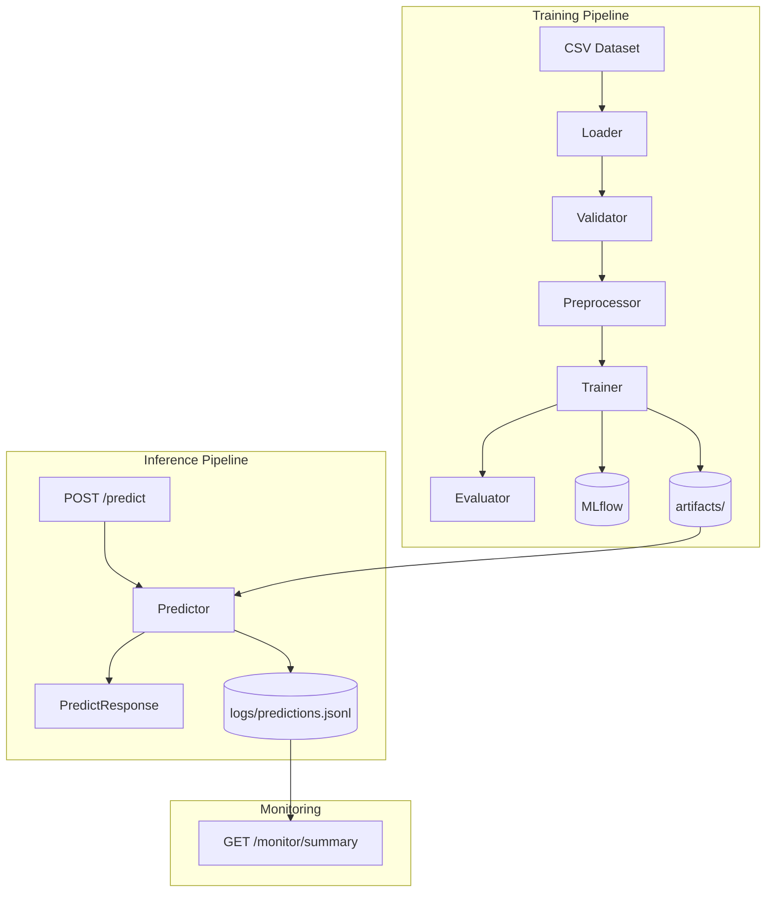

# MLOps Production Classification Service

A production-style machine learning classification service demonstrating the full MLOps lifecycle — from raw CSV data through training, experiment tracking, REST API inference, prediction logging, and monitoring — packaged for Docker and tested with GitHub Actions CI.

> **Dataset note:** The included dataset is synthetic and is used only to validate the pipeline. Replace it with your own data by updating `configs/config.yaml`.

---

## Why This Project Demonstrates MLOps

This project is intentionally designed to show the skills that matter for ML Engineer and MLOps roles:

| Skill | Demonstrated by |
|---|---|
| Production pipeline design | Separated loader → validator → preprocessor → trainer → evaluator modules |
| Experiment tracking | MLflow parameter, metric, and artifact logging |
| Model serialisation | joblib artifacts with versioned paths |
| REST API design | FastAPI with Pydantic validation, batch inference, and error handling |
| Prediction observability | JSONL logging + `/monitor/summary` aggregation endpoint |
| Drift awareness | Heuristic feature drift warnings logged per prediction |
| Containerisation | Multi-stage Dockerfile + docker-compose with volume mounts |
| CI/CD | GitHub Actions workflow: install → test → smoke-train |
| Configuration management | YAML config + .env overrides; no hardcoded paths |
| Test coverage | pytest across data, preprocessing, training, API, and monitoring layers |

---

## Features

- Config-driven training — swap dataset and model type in one YAML file
- Data validation with structured JSON report before training
- Auto-detection of numeric and categorical features
- Supported models: logistic regression, random forest, XGBoost (optional)
- MLflow experiment tracking (local or remote)
- FastAPI inference API with OpenAPI docs at `/docs`
- Single and batch prediction endpoints
- Per-prediction JSONL logging
- Monitoring summary endpoint
- Heuristic drift detection (numeric deviation + unseen categories)
- Docker deployment
- GitHub Actions CI

---

## Tech Stack

Python 3.11 · pandas · scikit-learn · MLflow · FastAPI · Pydantic · joblib · pytest · Docker · GitHub Actions

---

## Architecture



---

## Quick Start

### 1. Install

```bash
git clone <repo-url>
cd mlops-production-classification-service
python -m venv .venv && source .venv/bin/activate   # Windows: .venv\Scripts\activate
make install
```

### 2. Train

```bash
make train
```

This runs the full pipeline: validate data → fit preprocessor → train model → evaluate → log to MLflow.

### 3. Evaluate

```bash
make evaluate
```

Re-evaluates the saved model on the configured dataset and regenerates reports.

### 4. Launch MLflow UI

```bash
make mlflow-ui
# Open http://localhost:5000
```

### 5. Start API

```bash
make run-api
# API: http://localhost:8000
# Docs: http://localhost:8000/docs
```

### 6. Run Tests

```bash
make test
```

---

## Training Workflow

```
configs/config.yaml
    ↓
scripts/train.py
    ├── src/data/loader.py          → load CSV
    ├── src/data/validation.py      → validate, save reports/data_validation.json
    ├── src/features/preprocessing.py → fit ColumnTransformer
    ├── src/models/train.py         → train classifier
    ├── src/models/evaluate.py      → compute metrics, save reports/
    ├── src/monitoring/drift.py     → save training stats
    └── src/models/registry.py      → log run to MLflow
```

Artifacts produced:
- `artifacts/model/model.joblib`
- `artifacts/preprocessing/preprocessor.joblib`
- `artifacts/preprocessing/training_stats.json`
- `reports/data_validation.json`
- `reports/metrics.json`
- `reports/figures/confusion_matrix.png`
- `reports/model_card.md`

---

## API Inference Workflow

### Single Prediction

```bash
curl -X POST http://localhost:8000/predict \
  -H "Content-Type: application/json" \
  -d '{
    "features": {
      "age": 42,
      "tenure_months": 24,
      "monthly_spend": 120.5,
      "num_products": 3,
      "num_support_tickets": 0,
      "region": "north",
      "account_type": "premium",
      "payment_method": "bank_transfer"
    }
  }'
```

Response:
```json
{
  "prediction": "0",
  "confidence": 0.87,
  "model_version": "local-dev",
  "features_received": { "age": 42, "..." : "..." },
  "drift_warnings": []
}
```

### Batch Prediction

```bash
curl -X POST http://localhost:8000/predict/batch \
  -H "Content-Type: application/json" \
  -d '{
    "records": [
      {"age": 28, "tenure_months": 3, "monthly_spend": 30.0, "num_products": 1,
       "num_support_tickets": 5, "region": "north", "account_type": "basic", "payment_method": "credit_card"},
      {"age": 50, "tenure_months": 60, "monthly_spend": 200.0, "num_products": 4,
       "num_support_tickets": 0, "region": "west", "account_type": "premium", "payment_method": "bank_transfer"}
    ]
  }'
```

### Health Check

```bash
curl http://localhost:8000/health
```

### Model Info

```bash
curl http://localhost:8000/model/info
```

### Monitoring Summary

```bash
curl http://localhost:8000/monitor/summary
```

---

## MLflow Instructions

After training:

```bash
make mlflow-ui
# Navigate to http://localhost:5000
```

Each run logs:
- Parameters: model_type, test_size, random_seed, feature counts
- Metrics: accuracy, precision, recall, f1, roc_auc
- Artifacts: model.joblib, preprocessor.joblib, validation report, metrics JSON

To use a remote tracking server, set in `.env`:
```
MLFLOW_TRACKING_URI=http://your-mlflow-server:5000
```

---

## Docker Instructions

### Build and Start

```bash
make docker-build
make docker-up
```

The API runs at `http://localhost:8000`. Artifacts, logs, and MLflow runs are mounted as volumes.

### Stop

```bash
make docker-down
```

### Note

Train the model locally before starting Docker (or run `scripts/train.py` inside the container) — the container does not auto-train on start.

---

## Replacing the Dataset

1. Place your CSV in `data/`.
2. Edit `configs/config.yaml`:
   ```yaml
   dataset:
     dataset_path: "data/your_dataset.csv"
     target_column: "your_label_column"
   ```
3. Optionally specify features (or leave empty for auto-detection):
   ```yaml
   features:
     numeric_features: ["age", "amount"]
     categorical_features: ["category", "region"]
   ```
4. Run `make train`.

This service is designed for any tabular binary classification problem:
- Fraud detection
- Customer churn
- Medical diagnosis
- Purchase order routing
- Credit risk scoring

---

## Monitoring Strategy

All predictions are appended to `logs/predictions.jsonl`:

```json
{
  "timestamp": "2026-04-27T10:00:00Z",
  "input_features": {"age": 42, "region": "north"},
  "prediction": "0",
  "confidence": 0.87,
  "model_version": "local-dev",
  "drift_warnings": []
}
```

`GET /monitor/summary` aggregates totals, average confidence, prediction distribution, and drift warning counts.

**Drift detection** warns (does not block) when:
- A numeric feature deviates more than 2σ from the training mean.
- A categorical feature has a value not seen during training.

---

## Model Card

After training, `reports/model_card.md` contains:
- Model type and version
- Dataset used
- Test-split evaluation metrics
- Limitations (synthetic data disclaimer, no fairness audit)

---

## Limitations

- The included sample dataset is entirely synthetic. Do not use the reported metrics as a baseline for real problems.
- Drift detection is heuristic. Use scipy KS-test or the `evidently` library for production-grade monitoring.
- Prediction log grows unbounded. Add rotation for production deployments.
- No authentication on the API. Add API key or JWT middleware before exposing publicly.
- Single-process uvicorn. Add multiple workers or a load balancer for high-throughput production.

---

## Future Improvements

| Area | Improvement |
|---|---|
| Deployment | Kubernetes manifests and Helm chart |
| Cloud | AWS SageMaker / GCP Vertex AI / Azure ML deployment |
| Registry | MLflow Model Registry with staging/production aliases |
| Retraining | Automated retraining trigger on drift threshold |
| Feature store | Feast or Tecton integration |
| Drift detection | PSI, KS-test, or evidently integration |
| Observability | Prometheus metrics endpoint + Grafana dashboard |
| Auth | API key or JWT authentication middleware |
| Multiclass | Extend evaluation to macro/micro averaging |

---

## Portfolio Value

This project demonstrates:

- **MLOps pipeline design** — end-to-end flow from raw data to deployed API
- **Production code standards** — type hints, Pydantic validation, structured logging, config files
- **Experiment tracking** — MLflow integration with parameterised runs
- **API engineering** — FastAPI with OpenAPI docs, batch endpoints, error handling
- **Observability** — prediction logging, monitoring summary, drift warnings
- **Testing discipline** — unit tests for every layer; CI smoke-trains the pipeline
- **DevOps basics** — Docker, docker-compose, GitHub Actions, Makefile
- **Documentation** — architecture diagrams, model card, decision records, dataset README

---

## Repository Description (for GitHub)

**Description:**
> Production-style ML classification service: config-driven training, MLflow tracking, FastAPI inference, prediction logging, drift detection, Docker, and CI. Swap the dataset for fraud detection, churn, medical, or any tabular classification task.

**Topics:**
`machine-learning` `mlops` `fastapi` `scikit-learn` `mlflow` `classification` `docker` `python` `pydantic` `github-actions` `model-monitoring` `drift-detection` `portfolio`
